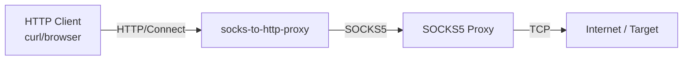

# socks-to-http-proxy  

An executable to convert SOCKS5 proxy into HTTP proxy

## About

`sthp` purpose is to create HTTP proxy on top of the Socks 5 Proxy

## How it works

## How it works

This tool acts as a bridge between HTTP clients and SOCKS5 proxies. It accepts standard HTTP/HTTPS requests and forwards them through a specified SOCKS5 proxy.

**Traffic Flow:**


Features:
- **HTTP Support**: Standard HTTP requests are forwarded.
- **HTTPS Support**: Handled via the HTTP `CONNECT` method, creating a tunnel through the SOCKS5 proxy.
- **Authentication**: Supports SOCKS5 username/password authentication.

It is built on top of the [hyper](https://hyper.rs/) library, extending the HTTP proxy functionality to tunnel traffic upstream via SOCKS5.

## Compiling

Follow these instructions to compile

1.  Ensure you have current version of `cargo` and [Rust](https://www.rust-lang.org) installed
2.  Clone the project `$ git clone https://github.com/KaranGauswami/socks-to-http-proxy.git && cd socks-to-http-proxy`
3.  Build the project `$ cargo build --release`
4.  Once complete, the binary will be located at `target/release/sthp`

## Usage

```bash
sthp -p 8080 -s 0.0.0.0:1080
```

This will create proxy server on 8080 and use localhost:1080 as a Socks5 Proxy

```bash
sthp -p 8080 -s example.com:8080
```

This will create proxy server on 8080 and use example:1080 as a Socks5 Proxy

> [!NOTE]  
> The --socks-address (-s) flag does not support adding a schema at the start (e.g., socks:// or socks5h://). Currently, it only supports socks5h, which means DNS resolution will be done on the SOCKS server.

> [!WARNING]
> After v5, Changed default listening IP from `0.0.0.0` to `0.0.0.0`. This change restricts the application access to the local machine only.

### Options

There are a few options for using `sthp`.

```text
Usage: sthp [OPTIONS]

Options:
  -p, --port <PORT>                        port where Http proxy should listen [default: 8080]
      --listen-ip <LISTEN_IP>              [default: 0.0.0.0]
  -u, --username <USERNAME>                Socks5 username
  -P, --password <PASSWORD>                Socks5 password
  -s, --socks-address <SOCKS_ADDRESS>      Socks5 proxy address [default: 0.0.0.0:1080]
      --allowed-domains <ALLOWED_DOMAINS>  Comma-separated list of allowed domains
      --http-basic <HTTP_BASIC>            HTTP Basic Auth credentials in the format "user:passwd"
  -d, --detached                           Run process in background ( Only for Unix based systems)
  -h, --help                               Print help
  -V, --version                            Print version
```

## Docker Support

You can build and run this project using Docker.

### 1. Build the Image

```bash
docker build -t socks-to-http-proxy .
```

### 2. Run the Container

Run with specific arguments (e.g., listening on all interfaces, connecting to a specific SOCKS5 proxy with auth):

```bash
docker run -d --name sthp -p 8080:8080 socks-to-http-proxy \
  --listen-ip 0.0.0.0 \
  --socks-address socks5:1080 \
  --username testuser \
  --password testpass
```

> **Note**: For `socks5:1080` to work, the container must be able to resolve `socks5` hostname (e.g., inside a Docker network). If connecting to a host proxy, use `host.docker.internal:1080`.

### 3. Using Docker Compose

The simplest way to run the stack (including a test SOCKS5 server) is via Docker Compose:

```bash
# Start the proxy and SOCKS5 server
docker compose up -d --build
```

## Testing & Verification

Once the application is running (default port `8080`), you can verify connectivity using `curl`.

### 1. Test HTTP Connectivity
Verifies that the proxy can forward standard HTTP requests.
```bash
curl -v -x http://localhost:8080 http://httpbin.org/ip
```
*Expected Output*: JSON response containing the IP of the exit node (SOCKS5 proxy).

### 2. Test HTTPS Connectivity
Verifies reliable secure tunneling (SSL/TLS) via the `CONNECT` method.
```bash
curl -v -x http://localhost:8080 https://httpbin.org/ip
```
*Expected Output*: Should establish a tunnel (`CONNECT tunnel established`) and return the same IP as above.

### 3. Verify Chain
If you are running the `docker-compose` setup, the IP returned by `httpbin.org` should match the public IP of the `socks5` container (or the `socks5` proxy you are connecting to), not your local machine's IP (unless the SOCKS5 proxy is local).

